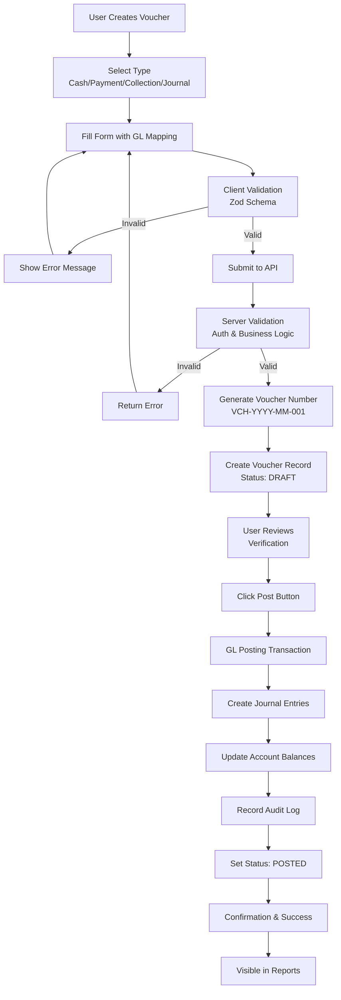
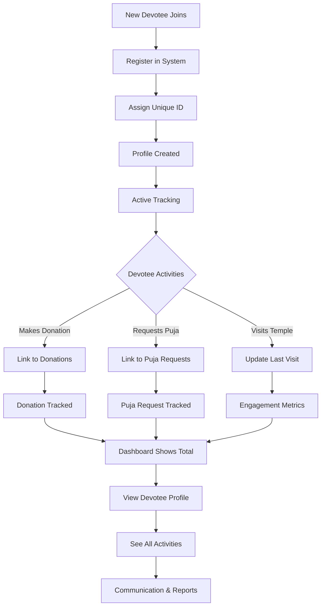
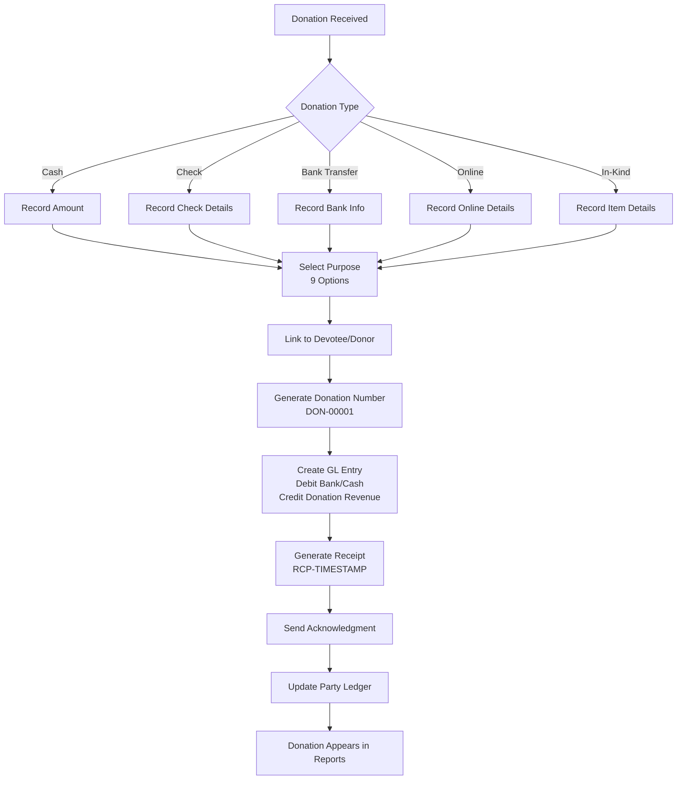
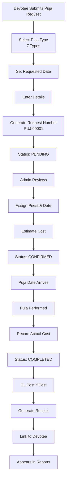
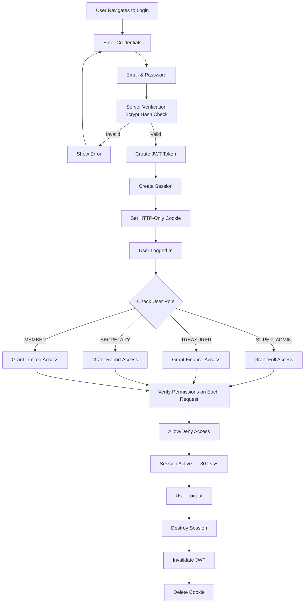
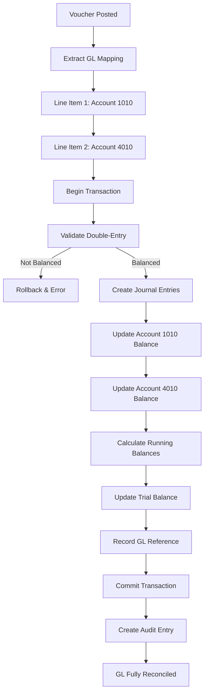
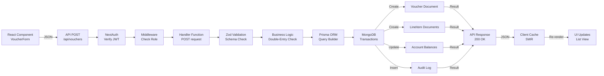
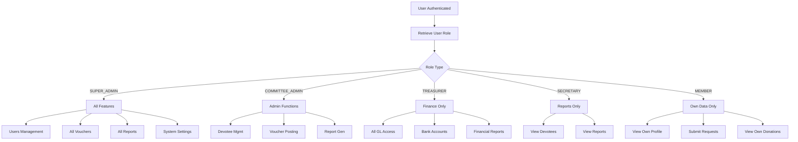
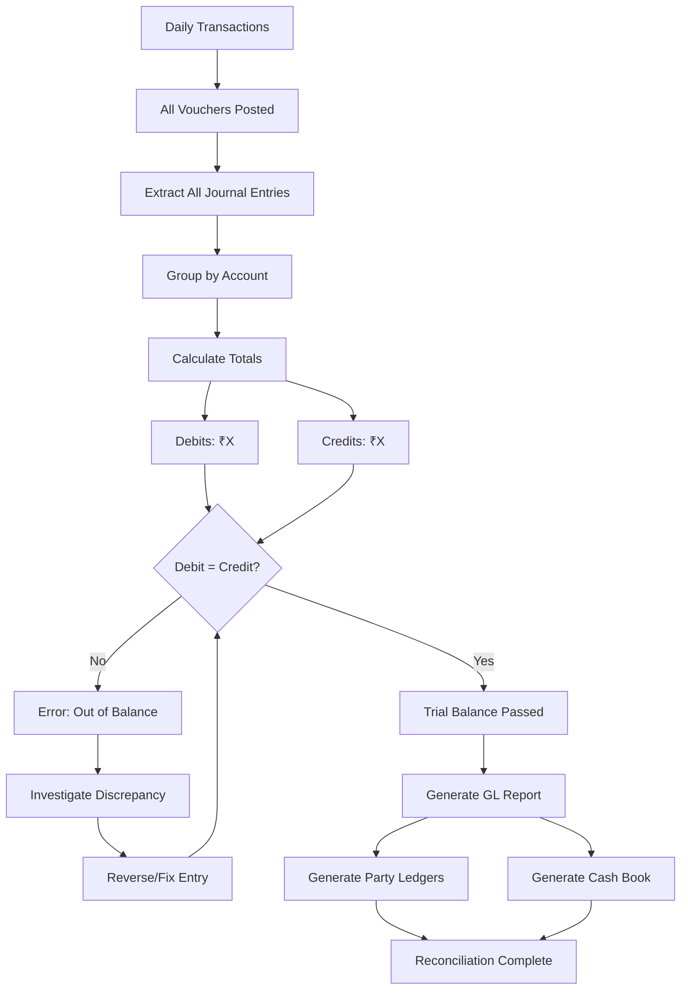
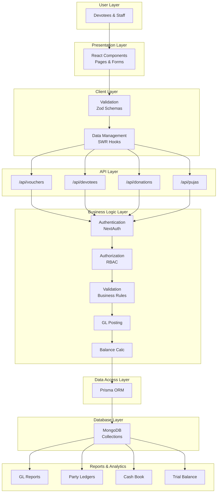

# Mandir Trust Accounting System - Mermaid Workflow Diagrams

## 1. Voucher Posting Flow

## 2. Devotee Lifecycle

## 3. Donation Processing

## 4. Puja Request Lifecycle

## 5. User Authentication Flow

## 6. GL Posting Process

## 7. Data Flow: Request to Database

## 8. Role-Based Access Control

## 9. Financial Transaction Reconciliation

## 10. Complete System Integration

## Key Characteristics

### Synchronous Operations
- All workflows are real-time
- Immediate feedback to users
- Instant GL posting
- Immediate balance updates

### Asynchronous Operations
- Email acknowledgments (future enhancement)
- Report generation (queued)
- Bulk imports (background jobs)

### Error Handling
- Client-side validation first
- Server-side validation always
- Transaction rollback on error
- Detailed error messages
- Audit trail of failures

### Data Integrity
- ACID transactions
- Double-entry verification
- Unique constraints
- Foreign key relationships
- Audit logging

---

## Conclusion

These workflows demonstrate:
- **Robustness**: Multiple validation layers
- **Security**: Authentication & authorization
- **Integrity**: Double-entry, audit trails
- **Usability**: Clear processes, immediate feedback
- **Scalability**: Efficient data flow, indexed queries
